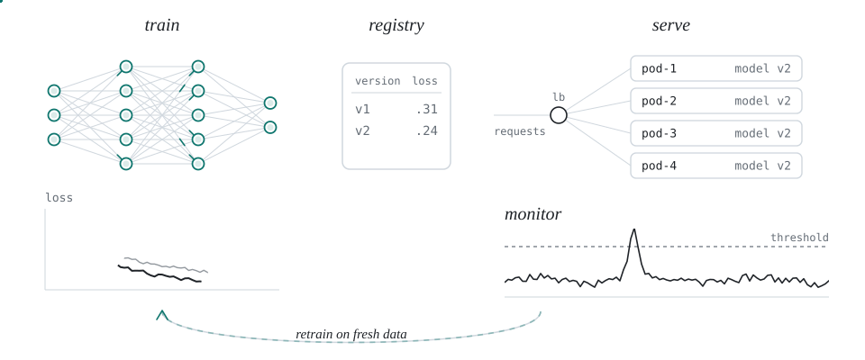

  <picture>
    <source media="(prefers-color-scheme: dark)" srcset="./assets/title-dark.svg">
    <source media="(prefers-color-scheme: light)" srcset="./assets/title-light.svg">
    
  </picture>

  <picture>
    <source media="(prefers-color-scheme: dark)" srcset="./assets/tagline-dark.svg">
    <source media="(prefers-color-scheme: light)" srcset="./assets/tagline-light.svg">
    
  </picture>

  <picture>
    <source media="(prefers-color-scheme: dark)" srcset="./assets/hero-dark.svg">
    <source media="(prefers-color-scheme: light)" srcset="./assets/hero-light.svg">
    
  </picture>

 

  <picture>
    <source media="(prefers-color-scheme: dark)" srcset="./assets/h-stack-dark.svg">
    <source media="(prefers-color-scheme: light)" srcset="./assets/h-stack-light.svg">
    
  </picture>

  <picture>
    <source media="(prefers-color-scheme: dark)" srcset="./assets/stack-dark.svg">
    <source media="(prefers-color-scheme: light)" srcset="./assets/stack-light.svg">
    
  </picture>

